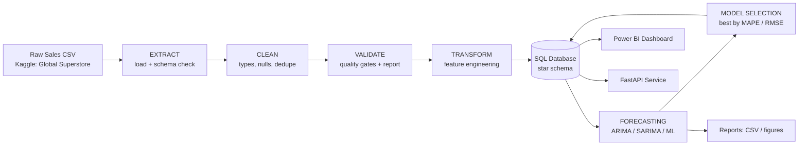

<div align="center">

# 📈 ForecastIQ

### AI-Powered Sales Forecasting & Business Analytics Platform

*Turn raw historical sales data into clean insights, demand forecasts, and interactive dashboards.*

[](https://www.python.org/)
[](https://pandas.pydata.org/)
[](https://scikit-learn.org/)
[](https://www.statsmodels.org/)
[](https://powerbi.microsoft.com/)
[](LICENSE)

</div>

---

## 🎯 Overview

**ForecastIQ** is an end-to-end analytics platform that ingests historical sales data, runs it through a
validated **ETL pipeline**, stores it in a **SQL star schema**, produces **time-series demand forecasts** using
multiple competing models, and surfaces everything through an **interactive Power BI dashboard** and an optional
**FastAPI** service.

It is designed to be **domain-agnostic** — it works for any business that has transactional sales history
(retail, distribution, B2B, subscriptions). The reference implementation uses the public
[Global Superstore](https://www.kaggle.com/datasets/apoorvaappz/global-super-store-dataset) dataset from Kaggle.

> Built as a portfolio project to demonstrate practical **data engineering, statistics, forecasting, and BI**
> skills on a realistic dataset — not a toy CRUD app.

---

## ✨ Key Features

| Area | Capabilities |
|------|--------------|
| **ETL** | CSV ingestion, schema validation, data cleaning, deduplication, feature engineering, load to SQL |
| **Data Quality** | Row-count reconciliation, null/type/range checks, referential-integrity checks, validation report |
| **Analytics** | Revenue analytics, product performance, regional analysis, RFM customer segmentation, KPIs |
| **Forecasting** | Monthly & quarterly demand forecasts, trend & seasonality decomposition, confidence intervals |
| **Modeling** | ARIMA, SARIMA, Prophet *(optional)*, Linear Regression, Random Forest, XGBoost *(optional)* |
| **Model Selection** | Backtesting on a hold-out window, automatic best-model selection by MAPE/RMSE |
| **Evaluation** | RMSE, MAE, MAPE, R² reported per model and per series |
| **Dashboards** | Power BI report: revenue trends, category/region breakdowns, forecast vs actual, KPIs, filters |
| **API** *(optional)* | FastAPI endpoints for KPIs and on-demand forecasts |
| **Reporting** | Exportable CSV/Excel forecast tables and PNG figures |

---

## 🏗️ Architecture



See [`docs/architecture.md`](docs/architecture.md) for the detailed component diagram and data flow.

---

## 📁 Repository Structure

```
ForecastIQ/
├── config/               # YAML configuration (paths, model params, thresholds)
├── data/                 # raw / interim / processed / external  (git-ignored)
├── sql/                  # DDL schema, analytical views, analysis queries
├── src/forecastiq/       # installable Python package
│   ├── etl/              # extract, clean, validate, transform, load
│   ├── forecasting/      # data, features, models, trainer, evaluator, predictor, visualizations
│   ├── analytics/        # KPIs, trends, RFM, products, regional, returns, insights
│   ├── api/              # FastAPI app (optional)
│   └── utils/            # logging, IO, config loader
├── app/                  # Streamlit platform (app.py, 10 pages, components, utils)
├── pipelines/            # entrypoints (run_etl.py, run_analytics.py, run_forecast.py)
├── notebooks/            # EDA, ETL demo, forecasting walkthrough
├── powerbi/              # dashboard build guide + DAX measures
├── docs/                 # architecture, schema, data dictionary, roadmap
├── tests/                # unit tests for validation, cleaning, metrics
└── reports/              # generated figures and forecast outputs
```

Full breakdown: [`docs/folder_structure.md`](docs/folder_structure.md).

---

## 🚀 Quick Start

```bash
# 1. Clone
git clone https://github.com/vinayakarya02/ForecastIQ.git
cd ForecastIQ

# 2. Create environment
python -m venv .venv
# Windows:  .venv\Scripts\activate
# macOS/Linux: source .venv/bin/activate

# 3. Install
pip install -r requirements.txt

# 4. Add data
#    Download "Global Superstore" from Kaggle and place the workbook at:
#    data/raw/Global Superstore.xls   (sheets: Orders, People, Returns; see docs/installation.md)

# 5. Run the ETL pipeline  (Excel workbook -> validated SQL warehouse)
python pipelines/run_etl.py

# 6. Run the analytics layer (KPIs, trends, segments, returns, auto-insights)
python pipelines/run_analytics.py        # exports to reports/analytics/

# 7. Run the forecasting pipeline (train, compare, select best, persist)
python pipelines/run_forecast.py --granularity monthly --horizon 6

# 8. Launch the interactive platform
streamlit run app/app.py                 # http://localhost:8501
```

Detailed setup: [`docs/installation.md`](docs/installation.md).

---

## 🧰 Tech Stack

**Language & Data:** Python 3.11, Pandas, NumPy, SQL (SQLite by default, PostgreSQL-ready)
**Modeling:** statsmodels (ARIMA/SARIMA), scikit-learn (Linear Regression, Random Forest), Prophet & XGBoost *(optional extras)*
**Visualization:** Plotly, Matplotlib, Power BI
**App:** Streamlit (multipage, cached, Plotly-powered)
**Serving:** FastAPI + Uvicorn *(optional)*
**Tooling:** pytest, Git, PyYAML, SQLAlchemy

---

## 📊 Modeling Approach

1. Aggregate the fact table to a **monthly (or quarterly) time series** per series (total, category, region).
2. Engineer features: **trend, cyclical seasonality, lags, rolling/moving averages**.
3. Fit competing models: **Naive, Moving Average, Linear Regression, ARIMA, SARIMA** (Prophet optional).
4. **Rolling-origin backtest** each model; score with **RMSE, MAE, MAPE, R²**.
5. **Automatically select the best model** per series, refit on full history, forecast with prediction intervals.
6. Persist forecasts + metrics back to SQL and render diagnostic figures.

Details & assumptions: [`docs/forecasting.md`](docs/forecasting.md).

---

## 🖥️ Interactive Application

A professional **Streamlit** platform sits on top of the warehouse and **reuses the analytics and
forecasting engines unchanged**. Ten pages, global sidebar filters that scope every view, interactive
Plotly charts, and CSV exports throughout.

```bash
streamlit run app/app.py        # http://localhost:8501
```

| Page | Shows |
|------|-------|
| 🏠 Home | overview, architecture, warehouse & forecast stats |
| 📊 Executive Dashboard | headline KPIs, revenue & profit trends |
| 📈 Sales Analytics | monthly/quarterly/yearly, growth, moving averages, breakdowns |
| 👥 Customer Analytics | RFM segments, CLV distribution, repeat & top customers |
| 📦 Product Analytics | category / sub-category / product performance, loss-makers |
| 🌍 Regional Analytics | market → city, region managers, world choropleth |
| ↩️ Returns Analytics | return rate, returned value, trends, hotspots |
| 🔮 Forecasting | pick a series, run the engine, view forecast + intervals + metrics |
| 💡 Business Insights | auto-generated rule-based observations |
| 🏁 Model Performance | compare every model (RMSE / MAE / MAPE / R²) |

**Global filters:** Year · Market · Region · Country · Category · Sub-category · Segment — every page
updates dynamically. Architecture: [`docs/app_architecture.md`](docs/app_architecture.md) ·
Deployment: [`docs/deployment.md`](docs/deployment.md).

<p align="center"></p>

---

## 🗺️ Roadmap

- [x] Architecture, repository structure, and database schema
- [x] ETL pipeline (Excel: Orders/People/Returns → validated star schema)
- [x] Analytics layer (KPIs, trends, RFM, products, regional, returns, insights) + EDA notebook
- [x] Forecasting engine (5 models, rolling-origin backtest, auto model selection, persisted forecasts)
- [x] Interactive Streamlit platform (10 pages, global filters, forecasting UI, exports)
- [ ] FastAPI service (optional)
- [ ] Power BI dashboard + DAX measures
- [x] Unit tests (66 passing) &nbsp;·&nbsp; [ ] CI

Full plan: [`docs/roadmap.md`](docs/roadmap.md).

---

## 📄 License

Released under the [MIT License](LICENSE). Dataset licenses belong to their respective Kaggle authors.

## 👤 Author

**Vinayak Arya** — B.Tech CSE (AI & ML), IIIT Nagpur
[LinkedIn](https://www.linkedin.com/in/vinayak-arya-325819278/) · [GitHub](https://github.com/vinayakarya02)
