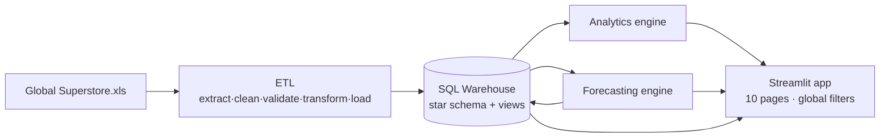
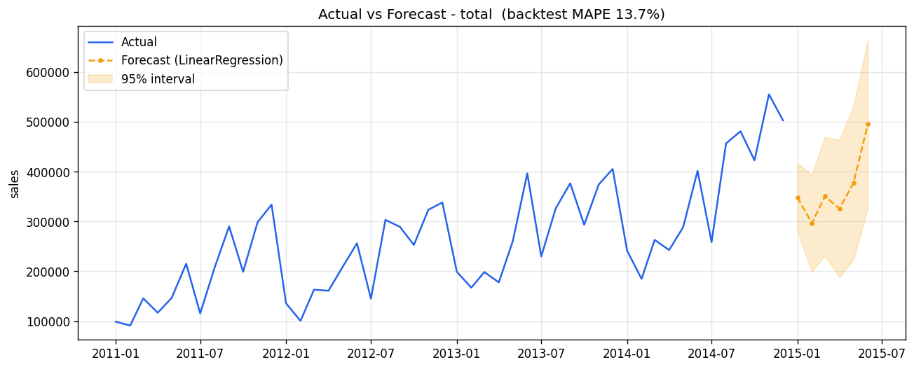

<div align="center">

# ForecastIQ

**AI-Powered Sales Forecasting & Business Analytics Platform**

Turn raw transactional sales data into clean insights, demand forecasts, and an interactive BI app.

[](https://github.com/vinayakarya02/ForecastIQ/actions/workflows/ci.yml)
[](https://www.python.org/)
[](https://docs.astral.sh/ruff/)
[](https://streamlit.io/)
[](LICENSE)

</div>

---

## Overview

ForecastIQ is an end-to-end platform that ingests historical sales data through a validated ETL pipeline,
stores it in a SQL star-schema warehouse, computes a full suite of business analytics, produces
time-series demand forecasts with automatic model selection, and surfaces everything through a 10-page
interactive Streamlit application.

It is domain-agnostic — it works for any business with transactional sales history (retail, distribution,
B2B). The reference implementation uses the public
[Global Superstore](https://www.kaggle.com/datasets/apoorvaappz/global-super-store-dataset) dataset
(51,290 order lines, 2011–2014, $12.64M revenue across 7 markets).

## Why

Most analytics side projects stop at a single notebook. ForecastIQ instead covers the full lifecycle a
data/analytics engineer owns: reliable ingestion with data-quality gates, a dimensional warehouse, reusable
analytics, honest forecasting with backtesting, and a real app on top — tested, linted, documented, and
deployable. No dataset is committed; the app runs on the real data if you add it, or on a clearly labelled
generated sample if you don't.

## Features

| Area | What it does |
|------|--------------|
| ETL | Excel (Orders / People / Returns) ingestion, cleaning, dedup, data-quality gates (PASS/WARN/FAIL), star-schema transform, SQL load |
| Warehouse | Kimball star schema (4 dims + fact), analytical views, forecast/metric output tables |
| Analytics | Executive KPIs, sales trends, RFM segmentation, product / regional / returns analytics |
| Insights | Rule-based engine — fastest-growing/declining categories, seasonality, returns, opportunities |
| Forecasting | Naive, MovingAverage, LinearRegression, ARIMA, SARIMA behind one interface |
| Model selection | Rolling-origin backtesting, automatic best-model pick, prediction intervals |
| Evaluation | RMSE, MAE, MAPE, R² per model per series, persisted to the warehouse |
| App | 10 Streamlit pages, global filters, Plotly charts, world map, interactive forecasting, CSV exports |
| Quality | 69 tests, Ruff lint/format, GitHub Actions CI, Docker |

## Architecture



Detailed design and per-layer diagrams: [`docs/architecture.md`](docs/architecture.md).

## Quick start

```bash
git clone https://github.com/vinayakarya02/ForecastIQ.git && cd ForecastIQ
python -m venv .venv && . .venv/Scripts/activate          # Unix: source .venv/bin/activate
pip install -e ".[app]"

python pipelines/run_etl.py         # 1. build the warehouse (generates a sample if no dataset)
python pipelines/run_analytics.py   # 2. KPIs, segments, insights -> reports/analytics/
python pipelines/run_forecast.py    # 3. backtest, select, forecast -> warehouse
streamlit run app/app.py            # 4. explore at http://localhost:8501
```

With `make`: `make install && make pipeline && make app`.

You can also just run `streamlit run app/app.py` on a fresh clone — the app builds its warehouse on first
launch, using a labelled synthetic sample if no dataset is present, so it deploys to Streamlit Community
Cloud with no manual steps. Drop the real `Global Superstore.xls` in `data/raw/` for actual figures. See
[`docs/deployment.md`](docs/deployment.md).

## Installation

Requires Python 3.10+. Install the package with the app extra (`.[app]`) or the pinned list
(`pip install -r requirements.txt`); the legacy `.xls` reader (`xlrd`) and all engines are included. Full
guide, including where to get the dataset: [`docs/installation.md`](docs/installation.md).

## Project structure

```
ForecastIQ/
├── config/               # config.yaml — paths, column map, quality rules, model params
├── sql/                  # star-schema DDL, analytical views, analysis queries
├── src/forecastiq/       # installable package (engine logic — reused everywhere)
│   ├── etl/              # extract · clean · validate · transform · load
│   ├── analytics/        # kpis · trends · segmentation · products · regional · returns · insights
│   ├── forecasting/      # data · features · models · trainer · evaluator · predictor · visualizations
│   └── utils/            # config loader · logging · IO/DB helpers
├── app/                  # Streamlit platform (app.py · 10 pages · components · utils)
├── pipelines/            # run_etl.py · run_analytics.py · run_forecast.py
├── notebooks/            # exploratory analysis notebook
├── tests/                # engine tests on fixtures + Streamlit AppTest page checks
├── docs/                 # architecture, methodology, installation, deployment, release
└── data/ · reports/      # git-ignored dataset & generated outputs
```

## Analytics methodology

Metric definitions live once (in SQL views and the `analytics` package) and are reused by the pipelines,
the app, and any BI tool — one source of truth.

- KPIs: revenue, profit, margin, orders, customers, AOV, average selling price, return rate.
- Trends: monthly/quarterly/yearly revenue, MoM and YoY growth, rolling averages.
- Customers: RFM quartile scoring into Champions / Loyal / At-Risk / …, basic CLV, repeat analysis.
- Products and regions: category → sub-category → product; market → region → country → city; region managers.
- Returns: return rate and returned value by region / category / product (order-grain).
- Insights: rules with data-derived thresholds (medians, growth signs, volume floors), not hardcoded
  numbers. See [`docs/analytics.md`](docs/analytics.md).

## Forecasting methodology

1. Aggregate the fact table to a monthly (or quarterly) series per slice (total / category / region / …).
2. Engineer features: trend, cyclical seasonality, lags, rolling/moving averages.
3. Fit five models — Naive, MovingAverage, LinearRegression, ARIMA, SARIMA (Prophet optional).
4. Backtest each with rolling origins (not a single split); score pooled out-of-sample predictions on
   RMSE / MAE / MAPE / R².
5. Pick the best model per series, refit on full history, and forecast ahead with prediction intervals.
6. Persist forecasts and metrics to the warehouse; render diagnostic figures.

On Global Superstore monthly revenue the seasonality-aware models (LinearRegression, SARIMA) beat the flat
baselines; per-series best MAPE lands around 12–21%. Model rationale, assumptions, and results are in
[`docs/forecasting.md`](docs/forecasting.md).

<p align="center"></p>

## Interactive application

A Streamlit app that reuses the analytics and forecasting engines unchanged: the global filters build a
scoped in-memory warehouse the engines run against, so no metric logic is duplicated in the UI.

| Page | Shows |
|------|-------|
| 🏠 Home | overview, architecture, warehouse & forecast stats |
| 📊 Executive Dashboard | headline KPIs, revenue & profit trends, summary |
| 📈 Sales Analytics | monthly/quarterly/yearly, growth, moving averages, breakdowns |
| 👥 Customer Analytics | RFM segments, CLV distribution, repeat & top customers |
| 📦 Product Analytics | category / sub-category / product performance, loss-makers |
| 🌍 Regional Analytics | market → city, region managers, world choropleth |
| ↩️ Returns Analytics | return rate, returned value, trends, hotspots |
| 🔮 Forecasting | pick a series, run the engine, view forecast + intervals + metrics + table |
| 💡 Business Insights | rule-based business observations |
| 🏁 Model Performance | compare every model (RMSE / MAE / MAPE / R²) |

Global filters: Year · Market · Region · Country · Category · Sub-category · Segment. App design:
[`docs/app_architecture.md`](docs/app_architecture.md).

## Technology stack

| Layer | Tools |
|-------|-------|
| Language & data | Python 3.11, Pandas, NumPy |
| Storage | SQL — SQLite by default, PostgreSQL-ready (SQLAlchemy) |
| Statistics & ML | statsmodels (ARIMA/SARIMA), scikit-learn (LinearRegression) |
| Visualisation | Plotly, Matplotlib |
| Application | Streamlit (multipage, cached) |
| Tooling | pytest, Ruff, pre-commit, GitHub Actions, Docker, PyYAML |

## Testing

```bash
pytest -q
ruff check . && ruff format --check .
```

Engine tests build in-memory warehouses from deterministic fixtures (no dataset needed); the Streamlit page
tests run every page through `AppTest` and skip themselves when no warehouse is present. CI runs all three
checks on Python 3.11 and 3.12.

## Deployment

Local, Docker (auto-builds the warehouse on first run), or Streamlit Community Cloud — see
[`docs/deployment.md`](docs/deployment.md). Configuration lives in `.streamlit/config.toml`; the database
URL is overridable via `FORECASTIQ_DB_URL`.

## Future improvements

- Optional FastAPI service exposing KPIs and forecasts as JSON (design in [`docs/api.md`](docs/api.md)).
- Power BI report over the same views (guide in [`powerbi/`](powerbi/README.md)).
- Prophet / gradient-boosted models behind the existing model interface.
- Scheduled refresh and anomaly alerts on MoM growth.

## Contributing

See [`CONTRIBUTING.md`](CONTRIBUTING.md) and [`CODE_OF_CONDUCT.md`](CODE_OF_CONDUCT.md). Quality gates:
`ruff check .`, `ruff format --check .`, `pytest -q`.

## License

[MIT](LICENSE). Dataset licenses belong to their respective Kaggle authors.

## Author

Vinayak Arya — B.Tech CSE (AI & ML), IIIT Nagpur ·
[LinkedIn](https://www.linkedin.com/in/vinayak-arya-325819278/) ·
[GitHub](https://github.com/vinayakarya02)
