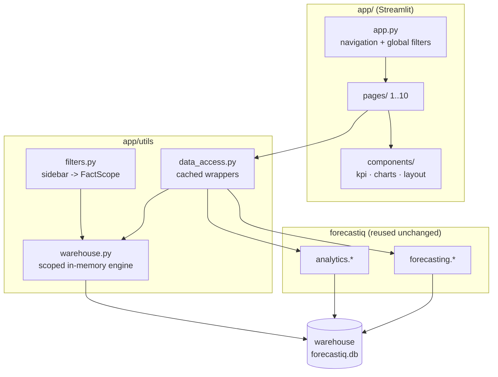

# ForecastIQ — Application Architecture

The Streamlit app is a **presentation layer** over the existing engines. It does not
re-implement any analytics or forecasting logic — it calls `forecastiq.analytics` and
`forecastiq.forecasting` and renders the results.



## How global filtering works (the key idea)
The existing analytics functions take a SQLAlchemy `engine` and query `fact_sales`/views. To make
**every page filterable without touching that code**, filters build a *scoped in-memory warehouse*:

1. The sidebar selections become a hashable `FactScope` (`utils/scope.py`).
2. `warehouse.engine_for(scope)` returns:
   - the **base on-disk engine** when no filters are active (fast path), or
   - a **filtered in-memory SQLite warehouse** — the fact table copied filtered by the scope's dimension
     conditions, dimensions copied whole, and the analytical views recreated (cached per scope).
3. The analytics/forecasting modules run against that engine **unchanged**.

This keeps a single source of truth for every metric and forecast, and makes filtering a data-scoping
concern rather than a logic change.

## Caching
| Layer | Cache | Keyed by |
|-------|-------|----------|
| Base + scoped engines | `st.cache_resource` | `FactScope` |
| Analytics results | `st.cache_data` | `FactScope` (+ params) |
| Forecast runs | `st.cache_data` | level, key, horizon, granularity |
| Filter options / warehouse stats | `st.cache_data` | — |

Forecasts always use the **full history** (base engine), independent of the global filters, because a
forecast needs the complete time series.

## Folder map
```
app/
├── app.py               # entry: st.navigation + global sidebar filters
├── pages/               # 10 pages (Home … Model Performance)
├── components/          # kpi cards, styled Plotly charts, layout helpers
└── utils/               # scope, warehouse (scoped engine), data_access, filters, format, export, theme
```

## Pages
| # | Page | Reuses |
|---|------|--------|
| 1 | Home | warehouse stats, forecast summary |
| 2 | Executive Dashboard | `analytics.kpis`, `trends` |
| 3 | Sales Analytics | `analytics.trends` (+ scoped breakdown) |
| 4 | Customer Analytics | `analytics.segmentation` |
| 5 | Product Analytics | `analytics.products` |
| 6 | Regional Analytics | `analytics.regional` (+ choropleth) |
| 7 | Returns Analytics | `analytics.returns` |
| 8 | Forecasting | `forecasting.*` (interactive) |
| 9 | Business Insights | `analytics.insights` |
| 10 | Model Performance | persisted `model_metrics` |

## Testing
`tests/test_app_pages.py` runs every page through Streamlit's `AppTest` and asserts no exception —
executed as part of the normal `pytest` suite.
