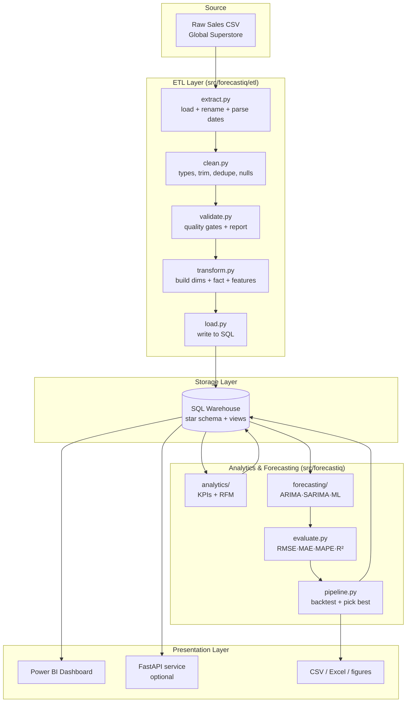
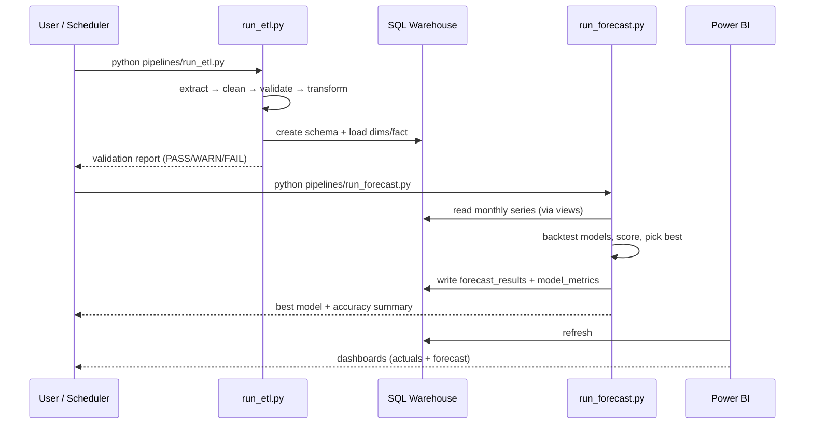

# ForecastIQ — Architecture

## 1. Goals

- **Reliable**: every load passes explicit data-quality gates before it reaches the warehouse.
- **Reproducible**: one command runs the whole pipeline; behaviour is driven by `config/config.yaml`.
- **Dataset-agnostic**: onboarding a new sales dataset means editing a column map, not the code.
- **Layered**: ETL, storage, modeling, and presentation are cleanly separated so each can evolve independently.

## 2. High-level component diagram

## 3. Layers

### 3.1 ETL layer
A linear, testable pipeline. Each stage is a pure-ish function taking a DataFrame and returning a DataFrame
(plus a report), so stages can be unit-tested in isolation.

| Stage | Module | Responsibility |
|-------|--------|----------------|
| Extract | `etl/extract.py` | Read CSV, apply `column_map`, parse date columns, standardize dtypes |
| Clean | `etl/clean.py` | Trim strings, fix encodings, coerce numerics, drop exact duplicates, handle nulls |
| Validate | `etl/validate.py` | Run quality gates; emit `data_quality_log`; **fail fast** on FAIL-level checks |
| Transform | `etl/transform.py` | Build `dim_*` tables + `fact_sales`, engineer calendar & lag features |
| Load | `etl/load.py` | Create schema, upsert dimensions, insert facts via SQLAlchemy |

### 3.2 Storage layer
A **star schema** (Kimball style) in SQLite by default, PostgreSQL-ready via a single connection-URL change.
Business logic lives in **SQL views** so the dashboard, API, and ad-hoc queries share one metric definition.
See [`database_schema.md`](database_schema.md).

### 3.3 Analytics & forecasting layer
- **Analytics** computes KPIs and RFM segmentation directly from the warehouse.
- **Forecasting** aggregates the fact table into monthly/quarterly series, backtests several models on a
  hold-out window, selects the best by MAPE/RMSE, and writes forecasts + metrics back to SQL.
  See [`forecasting.md`](forecasting.md).

### 3.4 Presentation layer
- **Power BI** connects to the warehouse/views for interactive exploration ([`dashboard_design.md`](dashboard_design.md)).
- **FastAPI** (optional) exposes KPIs and on-demand forecasts as JSON ([`api.md`](api.md)).
- **Reports** are exported to `reports/` as CSV/Excel tables and PNG figures.

## 4. Data flow (sequence)

## 5. Design decisions & trade-offs

| Decision | Rationale |
|----------|-----------|
| SQLite default, PostgreSQL-ready | Zero-config for reviewers to run locally; production path documented |
| Star schema over one flat table | Enables clean slicing by date/product/region/customer and smaller fact rows |
| Config-driven column map | New dataset = edit YAML, not code — keeps the platform generic |
| Backtest + auto model selection | Avoids cherry-picking a model; selection is data-driven and reproducible |
| Views for metrics | Single source of truth shared by Power BI, API, and SQL clients |
| Forecasts persisted to SQL | Dashboard stays fast and offline-friendly; no live model calls needed |

## 6. Non-goals

- Not a real-time streaming system (batch by design).
- Not a multi-tenant SaaS — single-analyst portfolio scope.
- No fabricated data: the platform ships empty and expects a real public dataset.
