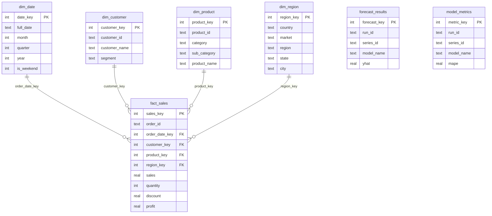

# ForecastIQ — Database Schema

A Kimball-style **star schema**: one central fact table (`fact_sales`) surrounded by conformed dimensions,
plus output tables the forecasting pipeline writes back to. DDL lives in [`../sql/schema.sql`](../sql/schema.sql).

## Entity–relationship diagram

## Tables

### Dimensions
| Table | Grain | Notes |
|-------|-------|-------|
| `dim_date` | one row per calendar day | `date_key` = `yyyymmdd`; carries month/quarter/year/weekend flags |
| `dim_customer` | one row per customer | natural key `customer_id`; carries `segment` |
| `dim_product` | one row per product | `category` → `sub_category` → `product_name` hierarchy |
| `dim_region` | one row per geography combo | country/market/region/state/city + `region_manager` (People sheet) |

### Fact
| Table | Grain | Measures |
|-------|-------|----------|
| `fact_sales` | one row per **order line** | `sales`, `quantity`, `discount`, `profit`, `shipping_cost`, `is_returned` (Returns sheet) |

Indexes on every foreign key keep dashboard aggregations fast.

### Pipeline outputs
| Table | Written by | Purpose |
|-------|-----------|---------|
| `forecast_results` | forecasting pipeline | point forecasts + confidence bounds; `is_actual` flags history rows |
| `model_metrics` | forecasting pipeline | RMSE/MAE/MAPE/R² per model per series; `is_best` marks the winner |
| `data_quality_log` | ETL validate step | PASS/WARN/FAIL audit trail per run |

## Why a star schema?
- **Slicing**: Power BI filters (date, region, category, segment) map directly to dimension joins.
- **Performance**: narrow fact rows + indexed keys aggregate quickly.
- **Clarity**: measures live in the fact; descriptive attributes live in dimensions — easy to explain in interviews.

## Portability
The DDL targets **SQLite**; PostgreSQL differences are annotated inline (`-- PG:`). Switching engines only
requires changing `FORECASTIQ_DB_URL` — SQLAlchemy handles the rest.
