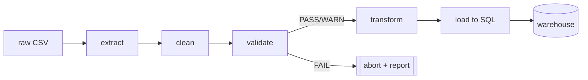

# ForecastIQ — ETL Pipeline

Entry point: `python pipelines/run_etl.py`
Config: `config/config.yaml` → `etl:` block.

## Stage 1 — Extract (`etl/extract.py`)
Source is `config.yaml → source` (`type: excel | csv`).

**Excel (Global Superstore workbook)** — read with `pandas.read_excel(sheet_name=None)`:
- **Orders** → rename via `column_map`, parse dates, keep only canonical columns (drops `Row ID`, `Postal Code`).
- **People** → build a region → manager map, resolve `region_aliases` (EMEA→AMEA), add `region_manager`.
- **Returns** → flag `is_returned` where (order_id, market) matches.

**CSV** — read encoding-robustly (`utf-8` → `latin-1`), same canonicalization, with `region_manager`/`is_returned` defaulted.

## Stage 2 — Clean (`etl/clean.py`)
- Strip/normalize whitespace and casing on key string columns.
- Coerce numeric columns (`sales`, `quantity`, `discount`, `profit`, `shipping_cost`); invalid → NaN.
- Drop **exact duplicate rows** (configurable).
- Handle nulls: drop rows missing a `required_columns` value; leave optional nulls for the validator to judge.
- Clip obviously invalid values (e.g. negative `quantity`) and log how many were touched.

## Stage 3 — Validate (`etl/validate.py`)
Quality gates, each producing a `PASS` / `WARN` / `FAIL` row in `data_quality_log`:

| Check | Level on failure |
|-------|------------------|
| Required columns present & non-null | FAIL |
| `sales`, `quantity`, `shipping_cost` non-negative | FAIL |
| `discount` within `[0, 1]` | WARN |
| Per-column null fraction ≤ `max_null_fraction` | WARN |
| `ship_date` ≥ `order_date` | WARN |
| No duplicate `order_id + product_id` at line grain | WARN |

**Fail-fast**: any `FAIL` aborts the run before touching the warehouse. The full report prints to console
(via `tabulate`) and is persisted for auditability.

## Stage 4 — Transform (`etl/transform.py`)
- Build conformed dimensions with surrogate keys: `dim_date`, `dim_customer`, `dim_product`, `dim_region`.
- Assemble `fact_sales` at order-line grain, replacing natural keys with surrogate keys.
- Engineer calendar attributes and the monthly time-series features listed in the data dictionary.

## Stage 5 — Load (`etl/load.py`)
- Execute `sql/schema.sql` to (re)create tables.
- Insert dimensions first, then facts (respects foreign keys), using SQLAlchemy + pandas `to_sql`
  with batched inserts inside a transaction.
- Run `sql/views.sql` to (re)create analytical views.
- Print a load summary (rows per table).

## Idempotency & re-runs
The pipeline is **rebuild-style**: each run recreates the schema and reloads from the validated source, so
repeated runs converge to the same warehouse state — safe to re-run after fixing data or config.

## Extending to a new dataset
1. Drop the new CSV in `data/raw/`.
2. Update `etl.column_map` and `etl.validation` in `config.yaml`.
3. Re-run `run_etl.py`. No code changes required.
