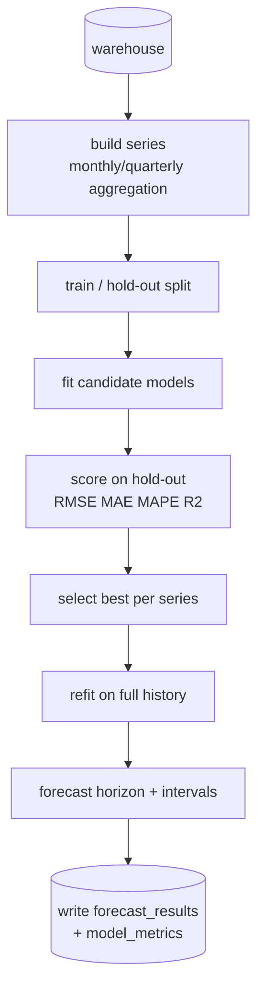

# ForecastIQ — Forecasting Pipeline

Entry point: `python pipelines/run_forecast.py --granularity monthly --horizon 6`
Config: `config/config.yaml` → `forecasting:` block.

## Problem framing
Forecast a business measure (**revenue** by default, or **quantity**) forward `horizon` periods for one or more
**series**: overall total, per category, per region. Each series is an independent univariate time-series problem.

## Series construction (`forecasting/preprocess.py`)
- Aggregate `fact_sales` to the chosen `granularity` using the `vw_monthly_sales` logic.
- Produce a continuous, gap-filled `DatetimeIndex` (missing periods → 0 or interpolated, logged).
- Build supervised features for ML models: lags (`t-1`, `t-12`), rolling mean, cyclical month encodings.

## Candidate models (`forecasting/models.py`)
| Model | Library | Captures | Notes |
|-------|---------|----------|-------|
| ARIMA | statsmodels | trend, autocorrelation | baseline classical model |
| SARIMA | statsmodels | trend + **seasonality** | `seasonal_order` with period 12 (monthly) |
| Linear Regression | scikit-learn | linear trend + calendar effects | on engineered features |
| Random Forest | scikit-learn | non-linear feature interactions | robust, few assumptions |
| Prophet *(optional)* | prophet | trend + seasonality + holidays | enable in config |
| XGBoost *(optional)* | xgboost | gradient-boosted interactions | enable in config |

All models share a common `fit(series) → forecast(horizon)` interface so adding one is a small, isolated change.

## Backtesting & selection (`forecasting/pipeline.py`)
1. Hold out the last `holdout_periods` observations.
2. Fit each enabled model on the training portion.
3. Predict the hold-out and compute metrics.
4. Select the model with the best `selection_metric` (default **MAPE**).
5. Refit the winner on the **full** history and forecast `horizon` periods ahead with confidence intervals.

> Honest evaluation: models never see the hold-out during fitting, so reported accuracy reflects true
> out-of-sample performance rather than in-sample overfitting.

## Metrics (`forecasting/evaluate.py`)
| Metric | Formula (intuition) | Why it's here |
|--------|--------------------|---------------|
| RMSE | √mean((y−ŷ)²) | penalizes large misses |
| MAE | mean(|y−ŷ|) | robust, same units as target |
| MAPE | mean(|y−ŷ|/|y|)·100 | scale-free % error, easy for stakeholders |
| R² | 1 − SS_res/SS_tot | variance explained |

## Outputs
- `forecast_results`: history (`is_actual=1`) + forward forecast (`is_actual=0`) with `yhat_lower/upper`.
- `model_metrics`: every model's scores per series, with `is_best=1` on the winner.
- `reports/forecasts/*.csv` and `reports/figures/*.png` for sharing outside Power BI.

## Assumptions & limitations (interview-honest)
- Monthly grain smooths daily noise but needs enough history (~24+ months) for stable seasonality.
- Classical models assume the series is reasonably regular; structural breaks (e.g. a new market launch)
  will degrade accuracy — surfaced by rising MAPE, not hidden.
- Confidence intervals are model-derived (statsmodels) or empirical (ML residual quantiles), and are
  approximate, not guarantees.
