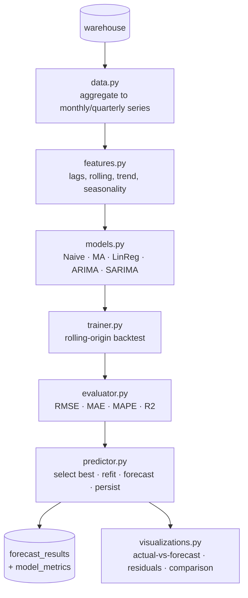

# ForecastIQ — Forecasting Engine

Entry point: `python pipelines/run_forecast.py --granularity monthly --horizon 6`
Config: `config/config.yaml` → `forecasting:` block.

The engine forecasts a business measure (revenue by default) forward `horizon` periods for one or more
**series** (total, per category, per region/market). Each series is an independent univariate problem:
build the series → backtest every model → select the best out-of-sample → refit on all history → forecast →
persist. It is designed to read like a commercial forecasting tool: explainable models, honest backtesting,
automatic-but-transparent selection.

## Architecture

| Module | Responsibility |
|--------|----------------|
| `data.py` | build gap-filled monthly/quarterly series for total/category/region/market/product |
| `features.py` | trend, cyclical seasonality, lag and rolling/moving-average features |
| `models.py` | five forecasters behind one `fit`/`forecast` contract + a model factory |
| `evaluator.py` | RMSE, MAE, MAPE, R² and best-model selection |
| `trainer.py` | rolling-origin backtesting, pooling out-of-sample predictions |
| `predictor.py` | refit winner on full history, forecast with intervals, persist to warehouse |
| `visualizations.py` | actual-vs-forecast, residual analysis, model & forecast comparison |

## Models — why each exists and what it assumes

| Model | Why it's here | Key assumptions |
|-------|---------------|-----------------|
| **Naive** | last-value baseline; every model must beat it to justify itself | next value ≈ current value (random walk) |
| **MovingAverage** | smooths noise; strong when the series is roughly flat | recent mean is a good predictor; no trend/seasonality |
| **LinearRegression** | explainable trend + seasonality + lags; inspectable coefficients | effects are additive/linear in the engineered features |
| **ARIMA(1,1,1)** | captures autocorrelation & non-seasonal structure via differencing | series is (difference-)stationary; no seasonality |
| **SARIMA(1,1,1)(1,1,1,12)** | ARIMA + explicit annual seasonality — fits retail's yearly cycle | stationary after seasonal + regular differencing; stable (enforced) |
| **Prophet** *(optional, off)* | additive trend/seasonality/holidays, robust to gaps | additive components; needs the `prophet` dependency |

**Prediction intervals.** ARIMA/SARIMA use statsmodels' analytic 95% intervals. Naive and the recursive
LinearRegression widen an empirical residual-σ band with the square root of the horizon (uncertainty
compounds as forecasts feed their own lags); MovingAverage uses a flat residual-σ band. Intervals are
approximate, not guarantees.

## Backtesting — rolling-origin, not a single split
A single train/test split can flatter or unfairly punish a model by luck of the cut-off. Instead the trainer
runs **rolling-origin cross-validation**: fit on history up to a cut-off, forecast the next `horizon`
periods, step the cut-off forward by `horizon`, repeat for `backtest_folds` folds. Predictions are pooled
across folds and scored once. A model that errors on *any* fold (or emits a non-finite forecast) is excluded,
so every model is judged on the same folds.

## Selection — why a given model wins
The model with the best `selection_metric` (default **MAPE** — scale-free and stakeholder-friendly) on the
pooled out-of-sample predictions is chosen, refit on the **full** history, and used for the forward forecast.
Selection is fully data-driven and reproducible; `model_metrics` records every model's score with `is_best`
marking the winner.

### Result on Global Superstore (monthly revenue, 3 folds × 6 months)
| Series | Winner | MAPE | R² |
|--------|--------|------|-----|
| total | LinearRegression | 13.7% | 0.70 |
| category: Furniture | **SARIMA** | 12.6% | 0.79 |
| category: Office Supplies | LinearRegression | 13.1% | 0.68 |
| category: Technology | LinearRegression | 20.6% | 0.36 |

The two seasonality-aware models (LinearRegression, SARIMA) clearly beat the flat baselines (Naive/MA/ARIMA
≈ 32–35% MAPE). Different series pick different winners — Furniture's strong yearly cycle favours SARIMA,
while the regression's explicit trend+seasonal features generalise best elsewhere.

> **Engineering note (defensible):** SARIMA was initially configured with
> `enforce_stationarity=False`, which allowed explosive non-stationary forecasts on the short 30-month
> backtest windows (MAPE ~97%). Restoring statsmodels' stability constraints (the default `True`) bounded the
> forecasts and made SARIMA competitive. On only four years of data a full seasonal ARIMA is near the edge of
> its data budget; with more history it would likely lead more series.

## Persistence
- `forecast_results` — observed history (`is_actual=1`) + forward forecast (`is_actual=0`) with `yhat_lower/upper`.
- `model_metrics` — RMSE/MAE/MAPE/R² for every model per series; `is_best=1` on the winner.
- Each run clears prior output and writes a fresh `run_id`, so the dashboard always reflects the latest run.
- CSV exports land in `reports/forecasts/`; figures in `reports/figures/`.

## Assumptions & limitations (interview-honest)
- Monthly grain needs ~24+ months for stable seasonality; 48 months is workable but modest for SARIMA.
- Missing months are gap-filled with 0 revenue before modelling (logged); a long zero-run would bias models.
- Recursive ML forecasts compound error over the horizon — hence widening intervals.
- Structural breaks (new market launches, price changes) are not modelled; they surface as rising MAPE rather
  than being hidden.
